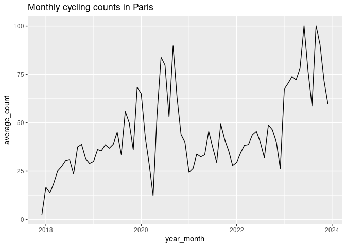

French cycle count datasets are available from
https://opendata.paris.fr/explore/dataset/comptage-velo-historique-donnees-compteurs/information/

<!-- https://opendata.paris.fr/api/datasets/1.0/comptage-velo-historique-donnees-compteurs/attachments/2023_comptage_velo_donnees_compteurs_zip/ -->
<!-- https://opendata.paris.fr/api/datasets/1.0/comptage-velo-historique-donnees-compteurs/attachments/2023_comptage_velo_donnees_sites_comptage_zip/ -->

There are two main zip files for each year:

- `comptage_velo_donnees_compteurs.zip` contains the count data
- `comptage_velo_donnees_sites_comptage.zip` contains the location data

Let’s import some data for 2023 using DuckDB, a high performance
in-memory SQL database.

``` r
library(duckdb)
```

    Loading required package: DBI

``` r
library(tidyverse)
```

    ── Attaching core tidyverse packages ──────────────────────── tidyverse 2.0.0 ──
    ✔ dplyr     1.1.4     ✔ readr     2.1.5
    ✔ forcats   1.0.0     ✔ stringr   1.5.1
    ✔ ggplot2   3.5.1     ✔ tibble    3.2.1
    ✔ lubridate 1.9.4     ✔ tidyr     1.3.1
    ✔ purrr     1.0.4     

    ── Conflicts ────────────────────────────────────────── tidyverse_conflicts() ──
    ✖ dplyr::filter() masks stats::filter()
    ✖ dplyr::lag()    masks stats::lag()
    ℹ Use the conflicted package (<http://conflicted.r-lib.org/>) to force all conflicts to become errors

``` r
u = "https://opendata.paris.fr/api/datasets/1.0/comptage-velo-historique-donnees-compteurs/attachments/2023_comptage_velo_donnees_compteurs_zip/"
f = basename(u)
download.file(u, paste0(f, ".zip"))
dir.create(f)
unzip(paste0(f, ".zip"), exdir = f)
list.files(f)
f_csv = list.files(f, pattern = "csv", full.names = TRUE)
system(paste("head", f_csv))
con = DBI::dbConnect(duckdb::duckdb(), ":memory:")
counts_paris_2023 = arrow::read_delim_arrow(f_csv, delim = ";")
names(counts_paris_2023)

#  [1] "Identifiant du compteur"                   
#  [2] "Nom du compteur"                           
#  [3] "Identifiant du site de comptage"           
#  [4] "Nom du site de comptage"                   
#  [5] "Comptage horaire"                          
#  [6] "Date et heure de comptage"                 
#  [7] "Date d'installation du site de comptage"   
#  [8] "Lien vers photo du site de comptage"       
#  [9] "Coordonnées géographiques"                 
# [10] "Identifiant technique compteur"            
# [11] "ID Photos"                                 
# [12] "test_lien_vers_photos_du_site_de_comptage_"
# [13] "id_photo_1"                                
# [14] "url_sites"                                 
# [15] "type_dimage"                               
# [16] "mois_annee_comptage" 
```

Let’s keep only the most important columns and rename them to English:

``` r
counts_paris_2023 = counts_paris_2023 |>
  select(
    counter_id = `Identifiant du compteur`,
    # counter_name = `Nom du compteur`,
    # site_id = `Identifiant du site de comptage`,
    # site_name = `Nom du site de comptage`,
    hourly_count = `Comptage horaire`,
    count_datetime = `Date et heure de comptage`,
    # site_install_date = `Date d'installation du site de comptage`,
    # lat_long = `Coordonnées géographiques`,
    # tech_counter_id = `Identifiant technique compteur`,
    # photos_id = `ID Photos`,
    # photos_url = `url_sites`,
    # image_type = `type_dimage`,
    # month_year = `mois_annee_comptage`
  )
dplyr::glimpse(counts_paris_2023)
```

Let’s create basic tables showing the counts per hour, day-of-the-week,
and per month:

``` r
counts_hourly = counts_paris_2023 |>
  mutate(hour = lubridate::hour(count_datetime)) |>
  group_by(hour) |>
  summarise(total_count = sum(hourly_count))
```

The ‘rush hour’ peaks can be seen from the 05:00-06:00 to 09:00-10:00
and 16:00-17:00 to 20:00-21:00 bins:

``` r
counts_hourly |>
  slice(c(6:10, 16:21)) |>
  knitr::kable()
```

The busiest days of the week are shown in the table below.

``` r
counts_dow = counts_paris_2023 |>
  mutate(dow = lubridate::wday(count_datetime, label = TRUE)) |>
  group_by(dow) |>
  summarise(total_count = sum(hourly_count))
counts_dow |>
  knitr::kable()
```

Let’s read in all count datasets:

<!-- https://opendata.paris.fr/api/datasets/1.0/comptage-velo-historique-donnees-compteurs/attachments/2018_comptage_velo_donnees_compteurs_csv_zip/ -->

``` r
years = 2018:2023
year = 2022
data_list = lapply(years, function(year) {
  u = paste0("https://opendata.paris.fr/api/datasets/1.0/comptage-velo-historique-donnees-compteurs/attachments/", year, "_comptage_velo_donnees_compteurs_csv_zip/")
  # u2 = "https://opendata.paris.fr/api/datasets/1.0/comptage-velo-historique-donnees-compteurs/attachments/2018_comptage_velo_donnees_compteurs_csv_zip/"
  # waldo::compare(u, u2)
  # If year is 2022 or later, remove "_csv" from the URL
  if (year >= 2022) {
    u = gsub("_csv", "", u)
  }
  f = basename(u)
  download.file(u, paste0(f, ".zip"))
  dir.create(f)
  unzip(paste0(f, ".zip"), exdir = f)
  f_csv = list.files(f, pattern = "csv", full.names = TRUE)
  counts = arrow::read_delim_arrow(f_csv, delim = ";")
  counts = counts |>
    select(
      counter_id = `Identifiant du compteur`,
      hourly_count = `Comptage horaire`,
      count_datetime = `Date et heure de comptage`
    ) |>
    mutate(year = year)
  counts
})
data_full = bind_rows(data_list) 
# write parquet file
arrow::write_parquet(data_full, "counts_paris.parquet")
```

Let’s plot the growth in cycling based on simple average count values
each month:

``` r
data_full = arrow::read_parquet("counts_paris.parquet")
data_full |>
  mutate(year_month = lubridate::floor_date(count_datetime, "month")) |>
  summarise(average_count = mean(hourly_count), .by = year_month) |>
  ggplot(aes(x = year_month, y = average_count)) +
  geom_line() +
  labs(title = "Monthly cycling counts in Paris")
```


